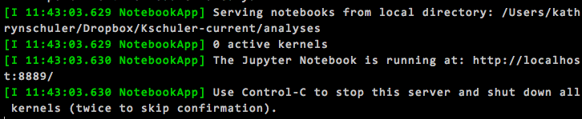
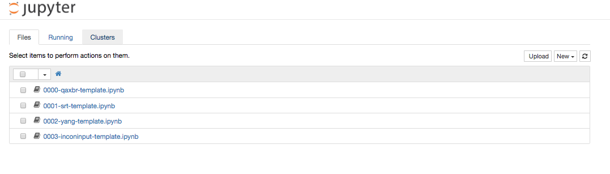

# Analyzing data (OLD METHOD)

Note that this is the method used to analyze data from July 2012 through July 2016.  Updated data analysis procedures are found [here](../guidelines/analyzing-data.md).

I analyze my data with an R kernel in [Jupyter notebooks](http://jupyter-notebook-beginner-guide.readthedocs.io/en/latest/what_is_jupyter.html).  A Jupyter notebooks is a document that contains executable code along with text and figures. [Here](https://www.dropbox.com/home/Research/summaries?preview=0010-srt-pilot.html) is an example of one of my analysis notebooks.

- [Setup Jupyter notebook](#setup-jupyter-notebook)
- [Opening the Jupyter notebook](#opening-the-jupyter-notebook)
- [My favorite R packages](#my-favorite-r-packages)
- [Data Day resources! (for Research Assistants)](#data-day-resources)

## Setup Jupyter notebook

Before you can analyze data, you must install the jupyter notebook. You can do this with `conda`. The computer you are using should already be setup with miniconda. You can check whether the computer has miniconda by going to the terminal and typing the following:
```
conda info
```

If you get information about the current conda install, you can proceed. If you get a notice `-bash: conda: command not found`, visit [setting up a computer](tools/computer-setup.md) for instructions on installing miniconda before you proceed.


First we are going to create a conda enviroment for the Jupyter notebook with the packages required to run the R kernel.  We will name the package jupyter.
```
conda create -n jupyter -c r r-essentials
```

Next we navigate to the new conda environment
```
source activate jupyter
```

And install jupyter into that environment
```
conda install jupyter
```

To exit the environment, type
```
source deactivate
```

## Opening the Jupyter notebook

To analyze data with Jupyter, you **must** activate the jupyter conda environment you created.

```
source activate jupyter
```
When you do this, you should see something like this appear in the terminal.


Once the jupyter environment is active, you can navigate to the analyses folder. (For research assistants, this is the 'Kschuler-current/analyses' folder in the learninglab Dropbox)
```
cd ~/Dropbox/Kschuler-current/analyses
```
And then open the jupyter notebook.
```
jupyter notebook
```
The notebook should be available at http://localhost:8888/ (or some other port number).



A browser will open with the jupyter notebook. You can click on any of the `.ipynb` files to open that particular notebook.



## My favorite R packages
- `%>%`
- `dplyr`
- `ggplot2`

## Data Day resources
For research assistants attending the summer data analysis meeting (Mondays at 10:30!)

#### Data Day 1 - June 13, 2016
  - [Intro to jupyter and style guidelines](https://www.dropbox.com/s/jr6r96h2e1jl8d5/data-day-number-1.html?dl=0)
  - [Production & rating experiment template](https://www.dropbox.com/s/1ghgbl62t2hnm0p/0104-inconinput-1day-pluralmorph-6733-training-summary.html?dl=0)