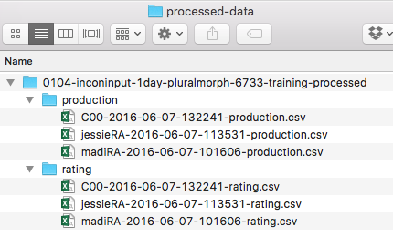

# Coding and transcribing

These are the guidelines I follow for coding and transcribing my production studies.

* [How to code and transcribe](#how-to-code-and-transcribe)
* [FAQs](#faqs)

### How to code and transcribe

##### What you need

For each participant, there are three important items that you need to have.

1. The `production` file, found with the participant's `raw-data`.
2. The `WAV` files, found in a folder with the `raw-data`.
3. The [data sheet](https://www.dropbox.com/s/26b0jsjogheey0a/0102-inconinput-1day-pluralmorph-6733-data-sheet.docx?dl=0), a hand-written sheet of paper from the experiment

##### Make copies of the `production` and `rating` files from `raw-data`

1. Make a copy of the participant's `production` file and put it int the `processed-data/production` folder. 
2. Make a copy of the participant's `rating` file and put it in the `processed-data/rating` folder.

Here is an example of what the processed data folder should look like.  This is the processed data folder for the `0104-inconinput-1day-pluralmorph-6733-training` experiment.

This ensure that the raw data itself is never touched.  There is no need to make copies of the audio files as you will not be altering them and they are not used for data analysis.

##### Setup the `production` file

Open the COPY you just made of the `production` data file in the `processed-data` folder for the experiment.

\*\*Updated 11\/08\/2016\*\*

Add 10 columns: `transcription`, `corrVerb`, `corrNoun`, `actualDet`, `categoryDet`, `notes`, \`exp.feedback\`, \`exp.prompt.verb\`, \`exp.prompt.noun\`, and \`exp.prompt.det\`.

##### Transcribe and code

You will fill in each of these columns with the following for each trial:

###### Transcribing

* `transcription`: what the participant actually said

###### Coding

* `corrVerb`: did they produce the correct verb? \(0 for no, 1 for yes\)
* `corrNoun`: did they produce the correct noun? \(0 for no, 1 for yes\)
* `actualDet`: what marker \(determiner\) did they produce? \(write it exactly\)
* `categoryDet`: what category does the marker belong to?
  * for inconinput the options are `maj`, `min`, `other`, and `null`
  * for yang the options are `R`, `e`, `other`, and `null`

* `notes`: write any notes you feel would help
  * for example: the child produced `ka` as `ko`; transcriptions are missing; etc

Here is an example with some of the trials filled in.

### FAQs

##### How do I "transcribe" the sound files for the `transcription` column?

> Listen to the `WAV` file for the trial in Audacity. Write what the participant said, word-for-word, in quotes.  For example, `"gentif mawg ka. [Did I say it right?]"`.  If the participant goes off topic, transcribe that part in brackets `[ ]`.  If the participant goes off topic for a really long time \(this happens often with children\), just write `[child talking...]` in the brackets, or `[teacher interrupted...]`.  There is no need to write every single word the participant says when it is not related to the task.

##### What if the participant says the same word twice?

> If the participant says the same word twice, such as `gentif gentif mawg ka`, there are two things you can do.  First, check the participant's data-sheet to see how the experimenter recorded the trial. The data-sheet is considered to be the most accurate record of the trial. Second, use your best judgment during the transcription.  For example, the participant may have just stuttered as in `gentif, um, gentif mawg ka`. Interpret whether the participant intended to say the same word twice for the trial as best you can.  Make a note of this in the `notes` column.

##### What if the data sheet does not match the transcription?

> The data-sheet is considered to be the most accurate record of the trial.  When there is a conflict, go with what is written on the data-sheet. Make a note of the conflict in the `notes` column.

##### What if one of the three important items are missing?

> ###### Missing `production` file
> 
> If the production file is missing, check inside the experiment folder on the local computer.  \(In the `data` folder.\) If you cannot find it anywhere, make a note on the `subject tracking sheet` and recommend the subject for exclusion.  No further transcription or coding is necessary.
> 
> ###### Missing `WAV` files
> 
> If any or all sound files are missing, check inside the experiment folder on the local computer. \(In the `data` folder.\) If you cannot find them anywhere, make a note on the `production` file.  Use the `data-sheet` to fill in the `transcription` column.
> 
> ###### Missing data sheet
> 
> If the data sheet is missing, make a note on the `production` file.  Use the `WAV` files to fill in the `transcription` column.
> 
> ###### Missing both `WAV` files and data sheet
> 
> If both the data sheet and the `WAV` files are missing, make a note on the `subject tracking sheet` and recommend the subject for exclusion.  No further transcription or coding is necessary in this case.

##### How do I know what to put in `prod-det-category`?

> Here you will put the category of the marker that the participant used.  There are typically four options.  For inconinput, the options are:
> 
> * `maj`: the majority marker \(depends on language\)
> * `min`: the minority marker \(depends on language\)
> * `other`: some other word \(e.g. English +s, any other word\)
> * `null`: no marker used
> 
> For yang, the options are:
> 
> * `R`: the regular form \(`ka`\)
> * `e`: any exceptional form \(depends on language\)
> * `other`: some other word \(e.g. English +s, any other word\)
> * `null`: no marker used
> 
> If you are uncertain how to code something, just ask me in person.

