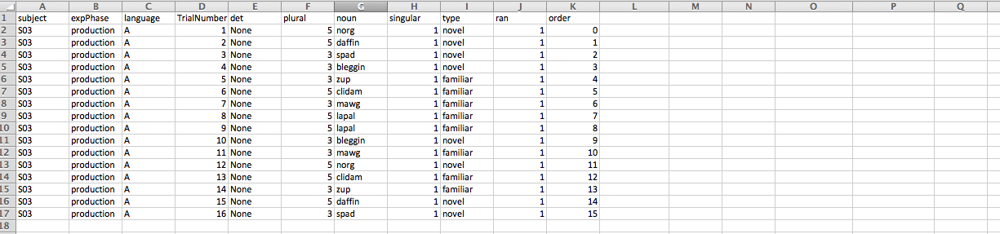
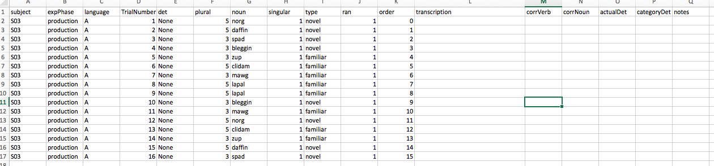

# Coding and transcribing

These are the guidelines I follow for transcribing my production studies.  For each participant, there are three important items that you need to have.

1. The `production` file, found with the participant's `raw-data`.
2. The `WAV` files, found in a folder with the `raw-data`.
3. The data sheet, a hand-written sheet of paper from the experiment

Open the participant's `production` data file.

Add 6 columns: `transcription`, `prod-verb`, `prod-noun`, `prod-det-actual`, `prod-det-category`, and `notes`.

You will fill in each of these columns with the following for each trial:
- `transcription`: what the participant actually said
- `prod-verb`: did they produce the correct verb? (0 for no, 1 for yes)
- `prod-noun`: did they produce the correct noun? (0 for no, 1 for yes)
- `prod-det-actual`: what determiner did they produce? (write it exactly)
- `prod-det-category`: what category does the determiner belong to?
  - for incon-input the options are `maj`, `min`, `other`
- `notes`: write any notes you feel would help
  - for example: the child produced `ka` as `ko`; transcriptions are missing; etc

