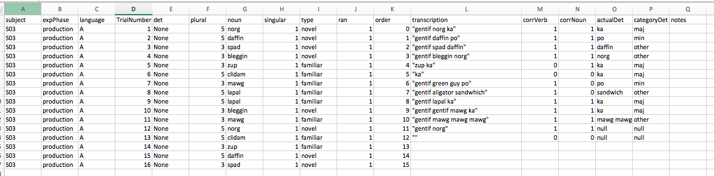

# Coding and transcribing
These are the guidelines I follow for coding and transcribing my production studies.  

- [How to code and transcribe](#how-to-code-and-transcribe)
- [FAQs](#faqs)

### How to code and transcribe
##### What you need
For each participant, there are three important items that you need to have.

1. The `production` file, found with the participant's `raw-data`.
2. The `WAV` files, found in a folder with the `raw-data`.
3. The [data sheet](https://www.dropbox.com/s/26b0jsjogheey0a/0102-inconinput-1day-pluralmorph-6733-data-sheet.docx?dl=0), a hand-written sheet of paper from the experiment

##### Setup the `production` file
Open the participant's `production` data file.

Add 6 columns: `transcription`, `prod-verb`, `prod-noun`, `prod-det-actual`, `prod-det-category`, and `notes`.

##### Transcribe and code
You will fill in each of these columns with the following for each trial:

###### Transcribing
- `transcription`: what the participant actually said

###### Coding
- `prod-verb`: did they produce the correct verb? (0 for no, 1 for yes)
- `prod-noun`: did they produce the correct noun? (0 for no, 1 for yes)
- `prod-det-actual`: what determiner did they produce? (write it exactly)
- `prod-det-category`: what category does the determiner belong to?
  - for incon-input the options are `maj`, `min`, `other`, and `null`
- `notes`: write any notes you feel would help
  - for example: the child produced `ka` as `ko`; transcriptions are missing; etc

Here is an example with some of the trials filled in.

### FAQs

##### How do I "transcribe" the sound files for the `transcription` column?

> Write exatly what the participant said, word-for-word, in quotes.  For example, `"gentif mawg ka. [Did I say it right?]"`.  If the participant goes off topic, transcribe that part in brackets `[ ]`.  If the participant goes off topic for a really long time (this happens often with children), just write `[child talking...]` in the brackets, or `[teacher interrupted...]`.  There is no need to write every single word that is said when it is not related to the task.

##### What if the participant says the same word twice? 

> If the participant says the same word twice, such as `gentif gentif mawg ka`, there are two things you can do.  First, check the participant's data-sheet to see how the experimenter recorded the trial. The data-sheet is considered to be the most accurate record of the trial. Second, use your best judgment during the transcription.  For example, the participant may have just stuttered as in `gentif, um, gentif mawg ka`. Interpret whether the participant intended to say the same word twice for the trial. 

##### What if the data sheet does not match the transcription?

> The data-sheet is considered to be the most accurate record of the trial.  When there is a conflict, go with what is written on the data-sheet. Make a note of the conflict in the `notes` column.

##### What if 

