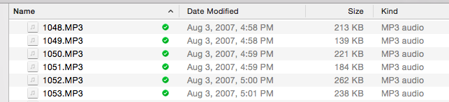
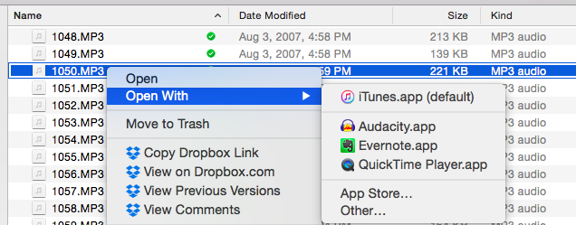
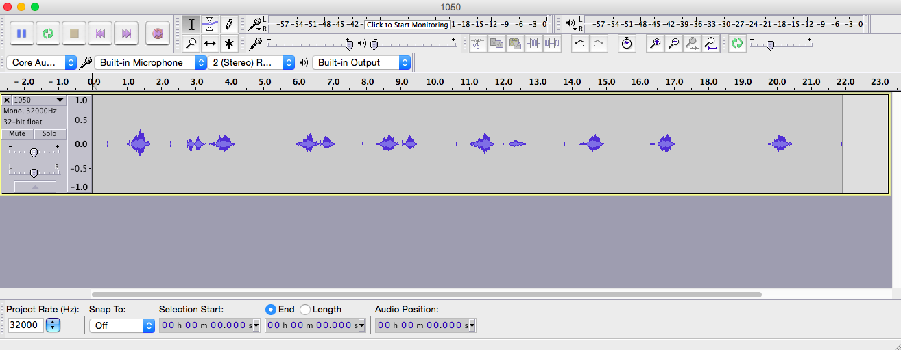
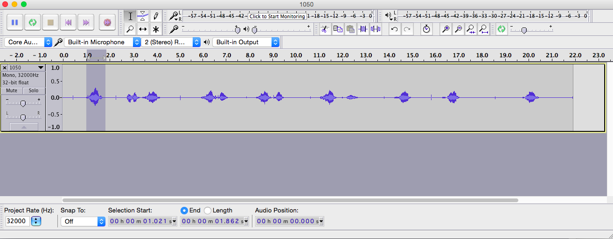
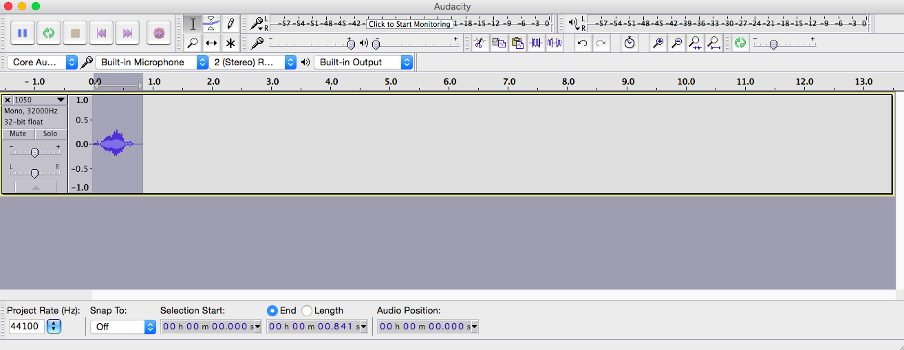

# Making stimuli

These are the general guidelines I follow when making stimuli for one of my experiments. 

- [Sounds](#sounds)
  - [How to record sounds](#how-to-record-sounds)
  - [How to edit sounds](#how-to-edit-sounds)
  - [How to synthesize sounds](#how-to-synthesize-sounds)
- [Images](#images)
  - [How to find image stimuli](#how-to-find-image-stimuli)
  - [How to edit image stimuli](#how-to-edit-image-stimuli)
- [Videos](#videos) 
  - [How to find video stimuli](#how-to-find-video-stimuli)
  - [How to record video stimuli](#how-to-record-video-stimuli)
  - [How to edit video stimuli](#how-to-edit-video-stimuli)

## Sounds

I prefer to create sound stimuli by recording actual human voices.  Afterward, I edit them to control for specific features like noise and duration.  While speech synthesizers are great these days, I find it difficult to get them to pronounce nonsense words the way I want them to.  If my studies used natural language words or sentences, I would be fine with synthesizing sound stimuli.

### How to record sounds

In our lab we record sounds using a Marantz PMD671 located in BldgD 145-D.  Below are the instructions for typical use of the Marantz PMD671 in our lab. The full manual for the Marantz PMD671 is available [here](../static/marantz-pmd671.pdf).

### How to edit sounds

I use Audacity to edit sound files for my experiments.  There are four ways in which I typically edit my sound files.  I select the best sample of a given stimulus, remove background noise, add or remove silence if necessary, and export as a `.wav` file.

##### Select the best sample

First, select the file that you want to work on.  If you recorded files with the marantz, these files will be numbered `.mp3` files.

Right click to open the sound file you want to work on with Audacity.

With the sound file open, listen to each of the recorded examples of the sound and select the one that sounds best to you.

To select in Audacity you just click and drag around the sound that you want.  In this example, I've selected the first one.  Make sure that you get at least a little bit of the silence around the sound.  You will need it to [remove background noise](#remove-background-noise) later.

With the best sound selected, hit `cmd + c` to copy it to the clipboard.

Open a new audacity file by hitting `cmd + n`.  Then paste the selected sound file into the new audacity file with `cmd + v`.

##### Remove background noise

##### Add or remove silence

##### Export final stimulus

### How to synthesize sounds
##### A short list of sounds

##### A long list of sounds

## Images

### How to find image stimuli

### How to edit image stimuli

There are two ways in which I typically edit image stimuli: removing background and re-sizing.  I like to edit images with [Inkscape](https://inkscape.org/en/), an open-source vector graphics editor.

##### Removing background from images

##### Re-sizing images

## Videos

### How to find video stimuli

### How to record video stimuli

### How to edit video stimuli

