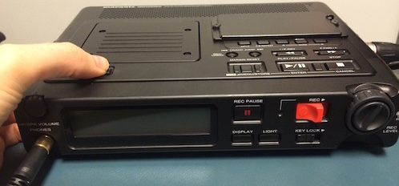

# Making stimuli

These are the general guidelines I follow when making stimuli for one of my experiments. 

- [Sounds](#sounds)
  - [How to record sounds](#how-to-record-sounds)
  - [How to edit sounds](#how-to-edit-sounds)
  - [How to synthesize sounds](#how-to-synthesize-sounds)
- [Images](#images)
  - [How to find image stimuli](#how-to-find-image-stimuli)
  - [How to edit image stimuli](#how-to-edit-image-stimuli)
- [Videos](#videos) 
  - [How to find video stimuli](#how-to-find-video-stimuli)
  - [How to record video stimuli](#how-to-record-video-stimuli)
  - [How to edit video stimuli](#how-to-edit-video-stimuli)

## Sounds

I prefer to create sound stimuli by recording actual human voices.  Afterward, I edit them to control for specific features like noise and duration.  While speech synthesizers are great these days, I find it difficult to get them to pronounce nonsense words the way I want them to.  If my studies used natural language words or sentences, I would be fine with synthesizing sound stimuli.

### How to record sounds

In our lab we record sounds using a Marantz PMD671 located in BldgD 145-D.  Below are the instructions for typical use of the Marantz PMD671 in our lab. The full manual for the Marantz PMD671 is available [here](../static/marantz-pmd671.pdf).

##### To record sound files on the Marantz PMD671

First, slide the `POWER` switch to the right and release to turn on the Marantz.



The display will show you how much time is available on the CF card for recording.


Next, slide the `REC` button to the right and release to begin recording. The "Rec indicator will be lit and steady while recording.  The display will show the recording time (`TRACK TIME`) of the current track (`TRACK`).


Push and release the STOP button to stop recording and end the track (close the audio file). The display will show you how much time is available on the CF card for recording.


##### To access sound files recorded on the Marantz PMD671

First, slide the `POWER` switch to the right and release the power off.  Then, press and hold the USB MENU/STORE button while you slide the POWER switch to the right and release.


        The  power is on.  The display will read "USB Online".

The CF card appears as a removable device on your computer.  
        Your recorded audio files are in a folder named MPGLANG1 as numbered MP3 files 


CAUTION - IMPORTANT

Move ONLY the audio files (tracks) to other volumes.  DO NOT modify or deleted the EDL file.  
        The Marantz will be unable to recognize recorded tracks if the EDL file is missing or damaged.

At the close of your session, make sure that the MPGLANG1 folder is empty of your recorded tracks.
        This ensures that the CF card will have enough space for other lab members recording sessions.
        Otherwise, the next user will have to listen to your recordings to decipher when hers begin.

### How to edit sounds

I use Audacity to edit sound files for my experiments.  There are four ways in which I typically edit my sound files.  I select the best sample of a given stimulus, remove background noise, add or remove silence if necessary, and export as a `.wav` file.

##### Select the best sample

First, select the file that you want to work on.  If you recorded files with the marantz, these files will be numbered `.mp3` files.


Right click to open the sound file you want to work on with Audacity.


With the sound file open, listen to each of the recorded examples of the sound and select the one that sounds best to you.


To select in Audacity you just click and drag around the sound that you want.  In this example, I've selected the first one.  Make sure that you get at least a little bit of the silence around the sound.  You will need it to [remove background noise](#remove-background-noise) later.


With the best sound selected, hit `cmd + c` to copy it to the clipboard. Open a new audacity file by hitting `cmd + n`.  Then paste the selected sound file into the new audacity file with `cmd + v`.


##### Remove background noise

To remove background noise, we first need to zoom in to our sound stimulus.  Use `cmd + 1` to zoom in.  (Note that `cmd +3` zooms out and `cmd + 2` returns the sound stimulus to its original size.)


Next we need to select a part of the silence to give Audacity a "noise profile".  Do this by clicking and dragging around the silence that you want to select.


Click `Effect > Noise Reduction` to open the "noise reduction" dialog box.


With your silence already selected and the "noise reduction" dialog box open, click the `Get Noise Profile` button.


Next, go back to the sound stimulus and select the entire audio sample.


Select `Effect > Noise Reduction` again to return to the "noise reduction" dialog box.  This time select `OK`.


You can adjust the dB of noise reduction, the sensitivity, and the smoothing.  For my experiments, the default selections are appropriate.  For reference, those default selections are:

- Noise reduction (dB) : 12
- Sensitivity: 6.00
- Frequency smoothing(bands): 0

##### Add or remove silence

To remove silence (or any section of the stimulus), select the portion of want to remove and click `delete`.


To add silence, place the cursor where you want to add the silence.  Here I've chosen the end of the stimulus.


Select `Generate > Silence...` from the Audacity menu.  


In the "silence" dialog box, enter the amount of silence you want to generate.  Here I have entered 30 seconds of silence.


Click `OK` to finish generating silence.

##### Export final stimulus

To export the final stimulus, select `File > Export Audio...` or `File > Export Selected Audio...` if you have selected a smaller portion of a file to export.


Enter a file name and select `WAV` format.


Select `Save`.  You can enter meta-data if you wish to.  I often leave this part blank.


Click `OK` to finish exporting your stimulus.

### How to synthesize sounds

##### Synthesize a short list of sounds

To synthesize sounds, you can use the `say` command in the terminal.  For example, to synthesize a single sound, you would type

```
say -v Alex -r 250 "say this please" -o ~/Desktop/say-this.wav --data-format=LEF32@32000
```
Each parameter in this command are:

- `say` is the command for Text-to-speech
- `-v Alex` use voice (`-v`) Alex 
- `-r 250` use a rate of 250 ms
- `"say this please"` is the text you want to synthesize
- `-o ~/Desktop/say-this.wav` is the path and name of the file you want to save
- `--data-format=LEF32@32000` is the format of the data (required for `WAV` files)

When I want so synthesize a short list of words or sentences with exactly the same parameters, I use my [synth-a-little.py](https://raw.githubusercontent.com/kschuler/helpers/master/synth-a-little.py) python script.


The parameters in the script are:

- `path` is the name of a folder I want to create to save my sound files in
- `voice` is the voice I want to use
- `rate` is the speech rate
- `wordList` is a list of words or sentences that I want to synthesize

To download the script, navigate to the directory you want to save the script in.  For example, the Desktop.
```
cd ~/Desktop
```

then use `curl` to download the script.
```
curl -o synth-words.py https://raw.githubusercontent.com/kschuler/helpers/master/synth-a-little.py
```

To run the script, first edit [synth-a-little.py](https://raw.githubusercontent.com/kschuler/helpers/master/synth-a-little.py) with the parameters you want to use.  Then navigate to the script's directory.  For example, if you saved `synth-words.py` on your Desktop you would navigate to the Desktop

```
cd ~/Desktop
```

And then run the script using
```
python synth-words.py
```

##### Synthesize a long list of sounds

When I need to synthesize a long list of sounds, or a list of sounds with different parameters, I use my synth-a-lot.py script.  This script reads parameters from a `.csv` file for each individual sound file.


## Images

### How to find image stimuli

### How to edit image stimuli

There are two ways in which I typically edit image stimuli: removing background and re-sizing.  I like to edit images with [Inkscape](https://inkscape.org/en/), an open-source vector graphics editor.  To show how to remove background and re-size images in [Inkscape](https://inkscape.org/en/), we will edit this picture of donuts.


##### Removing background from images

##### Re-sizing images


## Videos

### How to find video stimuli

### How to record video stimuli

### How to edit video stimuli


