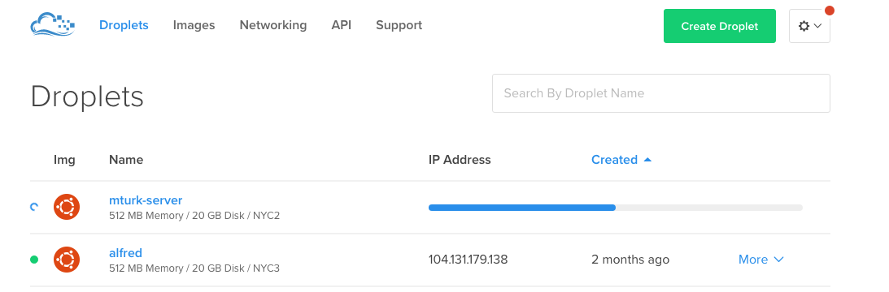

# Setting up a server

These are instructions for how I set up servers with Digital Ocean.  If you already have a server setup and want to install psiTurk, you can skip to that section by clicking [here](#get-miniconda-on-the-sever).

- [Get a Digital Ocean server](#get-a-digital-ocean-server)
- [Get Miniconda on the server](#get-miniconda-on-the-server)
- [Get psiTurk](#get-psiturk)

## Get a Digital Ocean server

The first step is creating an account on [Digital Ocean](https://www.digitalocean.com/).  Digital Ocean is a cloud service that allows users to create simple cloud servers for a small per month fee. You can download [GitHub's student developer pack](https://education.github.com/pack) to receive a $50 Digital Ocean credit. (And lots of other goodies!)

Once you have an account, log in to Digital Ocean and follow the instructions below to create a server.

### Create a Droplet

First you want to create a droplet by clicking on the green 'create droplet' button.

### Choose an image

Next you will choose an image. You want to click on the "One-click Apps" tab.


### Select LEMP on 14.04

You want to select the LEMP on 14.04 button.  This will set up a web server with a LEMP stack. LEMP stands for Linux, Nginx, MySQL, and PHP. These are just software that help you serve dynamic content over the web from your sever. The 14.04 part stands for Ubuntu 14.04, which is the type of server you'll have.


### Choose server size

I run small experiments (with between 25 to 150 subjects). The smallest size option has been more than enough for my purposes.


### Choose a region

You can think of this as where your server is physically located. I like to choose one of the New York regions - it seems nice to choose something nearby.


### Finish and create server

There are more options, but the one I'd recommend doing is "Choose a hostname".  If you are comfortable using SSH keys, then go ahead (I do), but it isn't necessary.  Just skip it if you find the whole idea overwhelming.

I named this server 'mturk-server'. Once you choose a name, you can click the green 'Create' button to create your server.


### Retrieve server information

You should see a screen that looks like this once you have created your server.  This means the server is starting up (sometimes digital ocean calls this "spinning up a droplet").



When the server has started up, you can click on it to get some information about it.


One of the most important pieces of information here is the IPv4.  This is your server's IP address, and you'll use this to talk to your server from your local computer.

You also need to know your server's root password.  Digital ocean will send you an email with information about your server (also called a droplet). This will contain your root password:


### Log in to server and change password

Now that you have created a server, you can talk to it from the terminal on your local computer. To do this, you first need to log-in to the server from the terminal.

Open a terminal window and enter the following (Be sure to swap my IP address for your server's IP Address)
```bash
ssh root@192.241.162.30
```

If you opted not to use an SSH key, you might see a message like this.  Answer yes to proceed.


You'll need to provide your servers password.  You get this from the email digital ocean sent you. Type it in exactly (case is important) and press enter.  

Next you will see "Changing password for root. (current) UNIX password".  The server wants you to type in the password digital ocean sent you AGAIN.  


Then it will ask for your new UNIX password.  Type in whatever you want your password to be.  This will be your server's new root password.


You'll need to retype the NEW password you selected. One you do so and press enter, you'll be in your sever!

To exit your server, you type exit in the terminal and press enter.

```bash
exit
```  
The next time you log in, you'll enter the NEW password you selected.


## Get Miniconda on the server

Coming soon...

## Get psiTurk

Once you have anaconda, use this to get psiturk.

```
conda install -c auto psiturk=1.0.3
```
